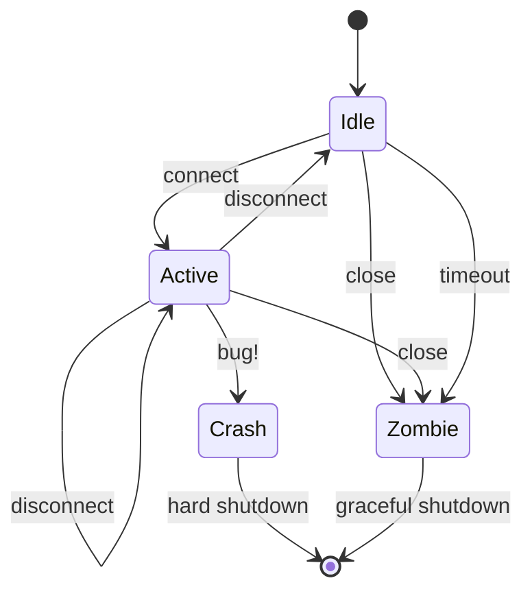

- Feature Name: rfc-0019-network-protocol
- Start Date: 2020-12-01
- Tremor Issue: [tremor-rs/tremor-runtime#0174](https://github.com/tremor-rs/tremor-runtime/pull/174)
- RFC PR: [tremor-rs/tremor-rfcs#0021](https://github.com/tremor-rs/tremor-rfcs/pull/0021)

# Summary

[summary]: #summary

Tremor Network Protocol Specification - Core

# Motivation

[motivation]: #motivation

Tremor is primary used for data distribution in the context of event
processing. Tremor supports an expanding set of `connectors` that allow
tremor to ingest data from external systems and to contribute data to external
systems based their respective supporting protocols.

As tremor evolves, there is a need for a standardized mechanism to address
networks of tremor-based systems talking to each other without relying on
external transports designed separately.

The protocol attempts to address the following:

* Provide an API and SDKs for communicating with tremor
* Support multiplexing multiple distinct communication streams simultaneously over a single physical connection
* A single pane of control, monitoring and security facilities
* The ability to establish communication streams using sub-protocol optimized for different purposes ( eg: cluster gossip between nodes in a tremor cluster, inter- and intra-cluster replication, publish subscribe )
* Convenience for operators and SREs of tremor-based systems

The messaging protocol specification supports the same type system and
value types available within tremor's scripting and query languages.

We constrain the type system to that of core tremor so that we may benefit
from enhancements to that type system such as the addition of support for
binary data [TODO_RFC_LINK]

The protocol is described in terms of the WebSocket specification, which we
use in this document as an illustrative guide. The initial implementation of
the tremor messaging protocol specification is planned to be WebSocket based.
However, alternative transport bindings and data format bindings may be defined
at a future date.


# Guide-level explanation

[guide-level-explanation]: #guide-level-explanation

The tremor network protocol specification introduces a managed
tremor native networked communication model designed to meet the
needs of tremor internal communications through a managed control
protocol and pluggable protocol dialects that can be tuned to common
data distribution, processing and inter-communication patterns.

The protocol imposes a control plane that enables establishing multiple
logical asynchronous message streaming sessions.

The control plane conforms to a finite state machine that completely
encapsulates all control and data plane interactions. This allows
consistent handling of errors, unified monitoring and administrative
control.

Data distribution and communication protocols can be established dynamically
through a bootstrap mechanism in the control plane that establishes a streaming
session to protocols available to a tremor runtime.

Protocols may be implemented in the rust programming language and built into
tremor itself, or implemented as pipelines in tremor and dynamically registered.

In this way, a single tremor connection can support multiple simultaneous logical
channels, conforming to different data distribution and communication models.

This specification concerns itself with the core enabling mechanisms and protocol
model and properties normatively. Illustrative examples of pluggable protocol dialects
are provided but are non-normative. Protocol dialects CAN and SHOULD be standardized
through separate RFCs.

As this protocol specification identifies a logical model only it implies that multiple
implementations of the protocol are possible using different transports and data
encodings or formats.

This specification references the WebSocket standard and tremor's JSON-like type
system. In the initial implementation of this specification the only available
transport will be WebSocket based, and the only available type system or message
format will be based on tremor value types.

# Reference-level explanation

[reference-level-explanation]: #reference-level-explanation

The specification resolves around 4 primary concerns:

1. Control.
2. Data.
3. Streams.
4. Drivers.

## 1. Control

The tremor messaging protocol specification defines a managed protocol. When a
tremor client connects to tremor server over the protocol the control plane
sub-protocol or conductor is established.

There is a single instance of the conductor active for the lifetime of the
connected network session.

### Lifecycle FSM

The control plane lifecycle is managed on the `server` side. For example,
for a WebSocket based transport driver the endpoint hosting the TCP service
listening for TCP clients is acting as a server.

Every accepted client connection will have a per session control plane state
machine managing the connected network protocol session.

In a tremor cluster interconnected with the tremor messaging protocol where
there is a peering nature, the sub protocol dialect for cluster gossip will
support the same cluster gossip protocol dialect events in both the client
to server and server to client directions of communication. From the perspective
of TCP the `server` and `client` disposition is significant as the `server`
manages lifecycle state machines. From the perspective of the cluster gossip
sub protocol the protocol events are effectively peer to peer.

This specification does not constrain, limit or standardize applications of
the protocol. This specification does not normatively specify the sub protocols
that are possible as these will be subject to other RFCs.

We are primarily concerned with layout out the control plane semantics and
conditions under which multiplexing multiple simultaneous protocol dialects
are managed and mediated by endpoints supporting the protocol.



### Connect

Messaging streams are established via the `connect` message.

The `connect` message establishes a logical communications channel.

```json
  { "tremor": 
    { "connect": 
      { "protocol": "pubsub",
        "properties": {
          "subscriptions": [
            "/pipeline/passthrough/out"
          ]
        }
      }
    }
  }
```

In the above example a `pubsub` stream is established via sending a
`connect` control plane event message. The `pubsub` protocol dialect
supports publish/subscribe semantics. It is configured through key/value
properties. In this case the initial subscriptions are configured to stream
events emitted from the pipeline registered as `passthrough` through its standard
output port `out`.

Once a protocol dialect stream session is established it can be controlled
via targeted control events directed at that sub protocol. If no stream alias
is specified when connecting, then the alias will be defaulted to the name of the
dialect.

It is an error to directly or indirectly overwrite an established streams
alias. We can establish multiple session streams through managing the assigned
aliases directly.

```json
  { "tremor": 
    { "connect": 
      { "protocol": "pubsub",
        "properties": {
          "subscriptions": [
            "/pipeline/passthrough/out"
          ]
        },
        "alias": "raw_json"
      }
    }
  }
```

In the above example we establish `pubsub` stream and alias it in the context
of this session as `raw_json`. We can dynamically manage our subscriptions through
issuing `subscribe`, `unsubscribe` or `subscriptions` control events.

```json
{ 
  "raw_json": { 
    "subscribe": [
      "/pipeline/passthrough/other_port"
    ]
  }
}
```

### Disconnect

Messaging streams established via the `connect` message can be
disconnected via the `disconnect`.

The `disconnect` message gracefully terminates a logical communications channel.

```json
  { "tremor": 
    { "disconnect": "raw_json" }
  }
```

### Close

Graceful termination of the protocol and all established sessions is
triggered via the `close` control event message.

The `close` message issues effectively disconnects each active streaming
session channel before closing and disconnecting the network connection.

If a server issues a `close` control event to a client it MUST disconnect
and close. If an implementation does not respect remote `close` then tremor
server's MAY force close, terminate and deny subsequent access.

### Version

The version control event message returns version information of the
remote tremor instance.

```json
{ "tremor": "version" }
```

## 2. Data

Business events are distributed through streaming message channels established
by the control plane `connect` event message. Business events MUST conform to
event message formats defined by pluggable protocol dialects. The type system is
further constrained to tremor's type system.

### Data Distribution Protocols

With the exception of the `tremor` control plane protocol normatively defined
by this specification, all other data distribution or communication protocols
are defined subject to constraints imposed by the control plane and are thereby
mediated and managed.

In practice, pluggable data distribution protocols MAY be implement as native
code and registered to tremor as builtin facilities. Pluggable protocols MAY
also be implemented in tremor as pipelines and scripted.

### Protocol Example

An echo protocol could be implemented as follows in tremor's
streaming query language:

```trickle
create stream sessions;

# Echo protocol session logical connection
select event from in where match event of
  # Session established
  case %{ connect ~= %{ protocol == "echo" } } => true
  default => false
end
into sessions;

# Connected
select { """{

  match event of
    case %{ absent alias } => "echo"
    case %{ present alias } => event.alias
  end

}""": "connected" } from sessions into out;

select event from in where match event of
  # Valid echo messages are echo'd
  case %{ present echo } => true
  # drop other messages
  default => false
end
into out;
```

### Echo Protocol Walkthrough

An echo protocol stream would be minimally established as follows:

```json
  { "tremor": 
    { "connect": 
      { "protocol": "echo"
      }
    }
  }
```

We establish the protocol session using the control plane `connect`
event message. Assuming an implementation based on a `trickle` query
pipeline as per the illustration above, we would receive a confirmation
after establishing an echo session:

```json
{"echo": "connected" }
```

Sending any legal value as an echo message should be returned by
response and echo'd back:

```json
{"echo": "beep"}
```

## 3. Streams

The protocol specifies a control protocol to negotiate multiple
data distribution or communication protocol sessions. At least
one stream must be active.

Multiple streams may be established from any supported protocol
via the `connect` control protocol message.

All established protocol streams are managed by the mediated by
the control protocol.

Malformed messages on any stream will result in the connection
being closed / terminated.


## Drivers

The default driver for the network protocol is tremor values
serialized as json over a websocket transport using text frames.

It is an error to send data over binary frames. Sending data over a
binary frame will result in the connection being closed.

In future revisions of tremor, the network protocol may support
multiple transports and alternate value serialization formats.

For example, the addition of binary values to tremor's type system
would allow binary websocket frames to be used with a binary wire
codec.

So the `<transport>/<format>` choices may speciate over time.

A `kafka/json` driver would make the network protocol available
via Kafka, with data encoded as json.

# Drawbacks

[drawbacks]: #drawbacks

The tremor value type system is JSON-like and ideally suited to
JSON-like value type structures. This reflects the reality that tremor
is used in production environments in domains where JSON-like data is the common
case.

This protocol specification does not address binary data distribution or handling.
The omission is by design and intentional.

When binary data representation, processing, marshalling and semantics are
added to tremor ( via an RFC ), this protocol specification will be revised
and enhanced accordingly.

# Rationale and alternatives

[rationale-and-alternatives]: #rationale-and-alternatives

As tremor-based systems are being built in an expanding set of technical
domains ranging from observability ( logging, monitoring, metrics ) to
search and cloud native data distribution and event processing with a
widening set of connectors to external systems the communication and
data distribution syntax, semantics and operating conditions or situational
qualify of service properties are continuously changing.

A fixed monolithic publish-subscribe messaging model is insufficient for this
purpose.

Similarly, as tremor is primarily an event processing engine used for real-time
stream processing of high throughput low-latency data streams from multiple
external systems - it is common to have multiple tiers where tremor is distributing,
processing and forwarding data - often with different delivery semantics and operational
QoS.

These concerns the core motivating drivers for pluggable protocols and the ability to
multiplex multiple streaming channels simultaneously over a single physical connection.

# Prior art

[prior-art]: #prior-art

Technologies such as the RabbitMQ multi-protocol message broker and the Apache Camel
project that implements enterprise integration patterns are both means by which
integration, messaging or data communication patterns are flexibly supported by a
runtime.

The separation of control mechanics and protocol patterns in this specification is not
dissimilar.

Technologies such as Aeron that allow pluggable transports or media drivers are also
relevant. In fact, Aeron as a network transport for tremor is a potentially interesting
future option.

# Unresolved questions

[unresolved-questions]: #unresolved-questions

None known at this time.

#Future possibilities
[future-possibilities]: #future-possibilities

The control plane lifecycle FSM does not include `HELO` messages. This would
enable the exchange of version information upon connection allowing participants
to better negotiate protocols at runtime.

There is no facility to redirect, forward or transfer a connection to another
tremor instance in the control plane.

----
